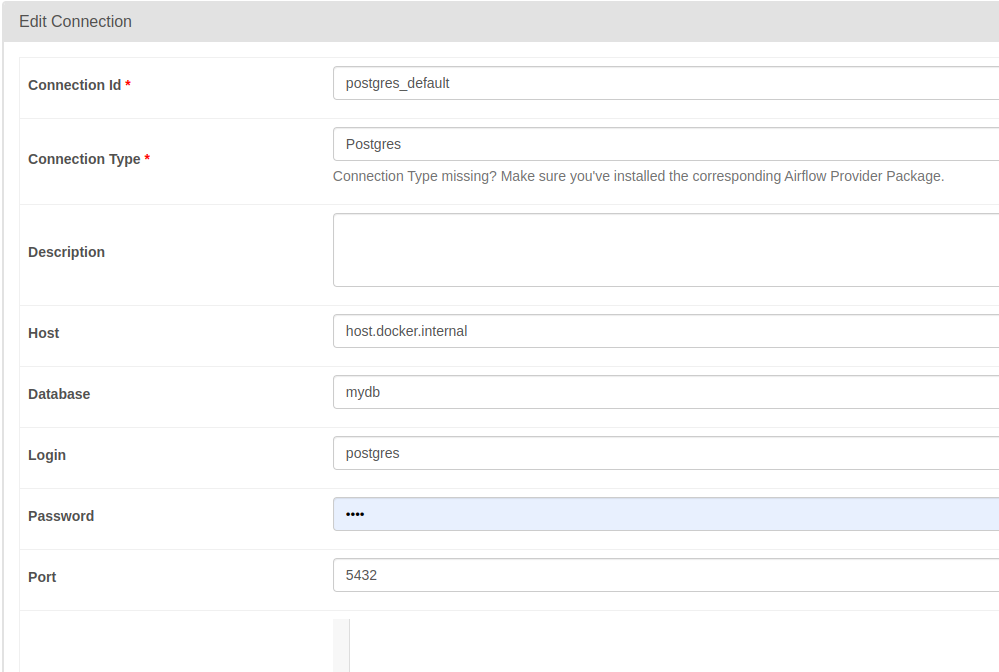

# Notes

- While creating the connection, carefully set the `host` name.
    - If you postgres DB is set into `localhost` thent he host name would be `host.docker.internal` as shown in the screenshot
    - If its set in any remote server, then the `server URL` should be inserted here